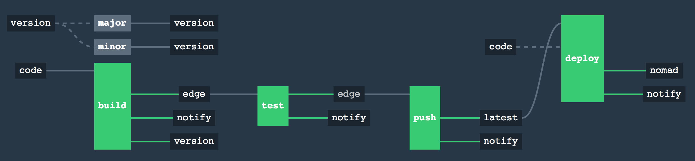

#### Notice!
I have a deeper dive that handles semver with Git tags as well as development branches and Pull requests: [https://github.com/TheCase/site-index](https://github.com/TheCase/site-index/tree/develop)  

## concourse-cicd-poc



CI/CD Example for Docker app using Concourse, Consul, Vault, Nomad, GitHub and DockerHub

- Semantic Versioning

	Concourse manages the versioning.  Each pushed commit bumps the patch increment.  You may interact with the Concourse GUI to increment minor and major version levels.
	  
- Docker build/test/push

	Concourse builds the latest commit as an edge version, tests the docker image as a true container, and pushes to Docker Hub as `latest` if the tests pass.
	
- Nomad deployment

	Using the included `hcl` job template, the latest image will be deployed to Nomad.


**Troubleshooting**

```
fatal: Remote branch version not found in upstream origin
error bumping version: exit status 128
```

you need to clone the repo and create a branch `version` with a single file named `version`.  Content should start with `0.0.1`

```
git clone git@github.com:TheCase/concourse-cicd-poc
cd concourse-cicd-poc
git checkout -b version
rm -rf *
echo '0.0.1' > version
git push --set-upstream origin version
```

